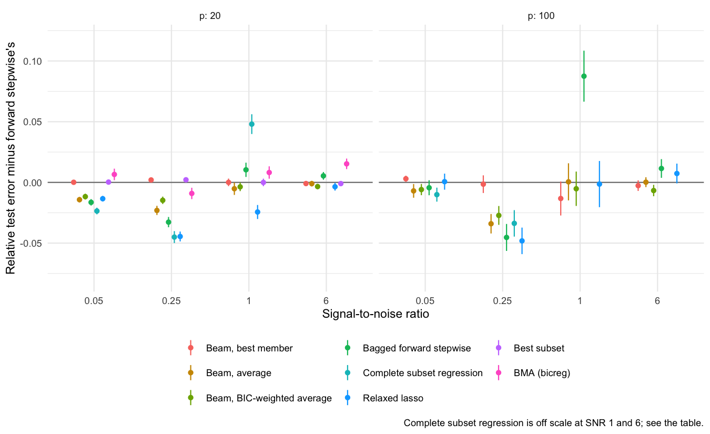

## Beam-averaged forward stepwise regression

Forward stepwise regression commits to one variable at a time. Beam search keeps the `w` best subsets at each size instead of one. This repo asks what to *do* with that beam:

- **Pick its best member.** This is what beam search usually does. It cannot beat best subset, which is what a beam wide enough to hold every subset returns, and best subset barely beats forward stepwise (Hastie, Tibshirani & Tibshirani 2020).
- **Average its members.** The `w` subsets disagree about borderline variables, so averaging their fits shrinks those coefficients toward zero by the share of members that leave them out. That is the same variance reduction bagging buys, with the disagreement coming from alternative good subsets of the same data rather than from resampled data.

### Algorithm

Inputs: training data `(X, y)` with `p` predictors, a validation set, a beam width `w` (10 here).

1. **Start** with a beam holding the empty model (intercept only).
2. **Grow by one variable**, for `k = 1, 2, …`:
   - For every subset `S` in the beam and every variable `j` not in `S`, form `S ∪ {j}`.
   - Score each candidate by its training residual sum of squares (RSS).
   - Drop duplicates: `{x1, x3}` can be reached from `{x1}` and from `{x3}`.
   - Keep the `w` lowest-RSS candidates as the new beam.
3. **Turn the size-`k` beam into one model.** Fit OLS on each member, then either
   - take the lowest-RSS member (*beam, best member*),
   - average the members' coefficient vectors with equal weights, with a variable a member leaves out counting as 0 (*beam, average*), or
   - weight members by BIC, which for members of equal size is proportional to RSS^(−n/2) (*beam, BIC-weighted average*).
4. **Choose `k`** by validation error.

Width 1 is forward stepwise. A width large enough to hold every subset is best subset. Both identities are tested against `leaps` (`tests/test_methods.R`).

### Prior art

Averaging the good models that a search turns up is old. I found no paper doing it for the forward stepwise beam:

| Work | Search | Averages? | Difference from this repo |
|---|---|---|---|
| Madigan & Raftery (1994), Occam's window; `BMA::bicreg` | `leaps` exhaustive, or their up/down search | Yes, BIC weights | Not forward stepwise. `bicreg` is capped at about 30 predictors. Included as a baseline. |
| Hans, Dobra & West (2007), shotgun stochastic search | Stochastic add / delete / swap moves | Yes, posterior weights | Stochastic search, not a beam; Bayesian weights |
| Granger & Jeon (2004), thick modelling | None | Yes, trimmed mean of the top models | No search |
| Elliott, Gargano & Timmermann (2013), complete subset regressions | None: all `k`-subsets | Yes, equal weights | No search. Included as a baseline. |
| Feng & Liu (2020), nested model averaging on the solution path | Lasso / SLOPE path | Yes, across sizes on one path | Lists "step-wise regression, forward regression" as future work |
| Beam search for feature selection (arXiv 2203.04350); OKRidge (Liu et al. 2023) | Forward beam | No, best member only | No averaging |
| Xin & Zhu (2012), stochastic stepwise ensembles | Randomised stepwise | Selection frequencies, not predictions | Built for variable selection |
| Breiman (1994), *Bagging Predictors* §5 | Forward stepwise on bootstrap samples | Yes | Averages over resampled data, not over a beam. Included as a baseline. |

### Results

The design is the Hastie, Tibshirani & Tibshirani (2020) simulation (`bestsubset::sim.xy`):

- n = 100, 5 true nonzero coefficients
- correlations ρ ∈ {0, 0.35, 0.7}
- coefficient patterns 1 and 2
- SNR ∈ {0.05, 0.25, 1, 6}

Every method picks its size (or tuning value) on an independent validation set of size n. Error is the exact relative test error, 1 + (b − β)ᵀΣ(b − β)/σ², where the null model scores 1 + SNR.

Best subset and `bicreg` run only at p = 20. Complete subset regression averages all subsets when there are at most 500 of a given size, and 500 random subsets otherwise.

<!-- results:start -->
Relative test error minus forward stepwise's, paired by replication
(mean ± 95% CI half-width; negative = better than forward stepwise).

**p = 20** (n = 100; 600 replications per SNR, pooled over correlations 0, 0.35, 0.7 and coefficient patterns 1 and 2)

| Method | SNR 0.05 | SNR 0.25 | SNR 1 | SNR 6 |
|---|---|---|---|---|
| Beam, best member | +0.000 ± 0.001 | +0.002 ± 0.002 | +0.000 ± 0.003 | -0.001 ± 0.001 |
| Beam, average | -0.014 ± 0.002 | -0.023 ± 0.004 | -0.005 ± 0.005 | -0.001 ± 0.002 |
| Beam, BIC-weighted average | -0.012 ± 0.002 | -0.015 ± 0.003 | -0.004 ± 0.004 | -0.003 ± 0.002 |
| Bagged forward stepwise | -0.016 ± 0.003 | -0.033 ± 0.004 | +0.010 ± 0.006 | +0.005 ± 0.003 |
| Complete subset regression | -0.024 ± 0.003 | -0.045 ± 0.005 | +0.048 ± 0.008 | +0.146 ± 0.008 |
| Relaxed lasso | -0.013 ± 0.002 | -0.045 ± 0.004 | -0.024 ± 0.006 | -0.004 ± 0.003 |
| Best subset | +0.000 ± 0.001 | +0.002 ± 0.002 | -0.000 ± 0.003 | -0.001 ± 0.001 |
| BMA (bicreg) | +0.007 ± 0.005 | -0.009 ± 0.005 | +0.008 ± 0.005 | +0.015 ± 0.004 |

**p = 100** (n = 100; 150 replications per SNR, pooled over correlations 0, 0.35, 0.7 and coefficient pattern 1)

| Method | SNR 0.05 | SNR 0.25 | SNR 1 | SNR 6 |
|---|---|---|---|---|
| Beam, best member | +0.003 ± 0.003 | -0.001 ± 0.007 | -0.013 ± 0.014 | -0.003 ± 0.004 |
| Beam, average | -0.007 ± 0.006 | -0.034 ± 0.008 | +0.000 ± 0.015 | +0.000 ± 0.004 |
| Beam, BIC-weighted average | -0.006 ± 0.005 | -0.027 ± 0.008 | -0.005 ± 0.014 | -0.007 ± 0.005 |
| Bagged forward stepwise | -0.004 ± 0.006 | -0.045 ± 0.011 | +0.087 ± 0.021 | +0.011 ± 0.008 |
| Complete subset regression | -0.010 ± 0.006 | -0.034 ± 0.011 | +0.389 ± 0.027 | +1.927 ± 0.082 |
| Relaxed lasso | +0.001 ± 0.007 | -0.048 ± 0.011 | -0.001 ± 0.019 | +0.007 ± 0.008 |


<!-- results:end -->

### What the results say

- **Picking the beam's best member buys nothing.** It matches best subset, and best subset matches forward stepwise. A wider search finds subsets with slightly lower training RSS, but that doesn't carry over to new data.
- **Averaging the beam helps at low SNR and never hurts.** It cuts relative test error by 0.014 and 0.023 (p = 20) and by 0.034 (p = 100, SNR 0.25). At high SNR it ties forward stepwise. Equal weights do at least as well as BIC weights, consistent with the forecast-combination literature.
- **Against the existing tools:**
  - It beats `bicreg` (BMA over Occam's window) at every SNR.
  - It beats bagged forward stepwise at SNR 1 and 6, where bagging hurts, but loses to it at low SNR.
  - Complete subset regression wins at low SNR and is far worse at high SNR.
- **Relaxed lasso matches or beats it in every cell.** Averaging the beam is the safe way to improve forward stepwise if you want subset-based models. It is not a reason to prefer subset methods over relaxed lasso.

At p = 100 only coefficient pattern 1 was run, because the p = 100 grid takes about 13 minutes per cell on 10 cores.

### Reproduce

```sh
Rscript -e 'renv::restore()'
Rscript tests/test_methods.R
Rscript R/run.R 100 results/raw 20
Rscript R/run.R 50 results/raw 100   # the README reports coefficient pattern 1 cells only
Rscript R/report.R
```

`R/methods.R` holds the estimators, `R/sim.R` one replication, `R/run.R` the grid (one checkpoint file per cell), and `R/report.R` the tables, figure and the results block above.

The previous version of this repo (a Python notebook) chose variables by their test-set error and reported that same error. It has been removed; it is in the git history.
